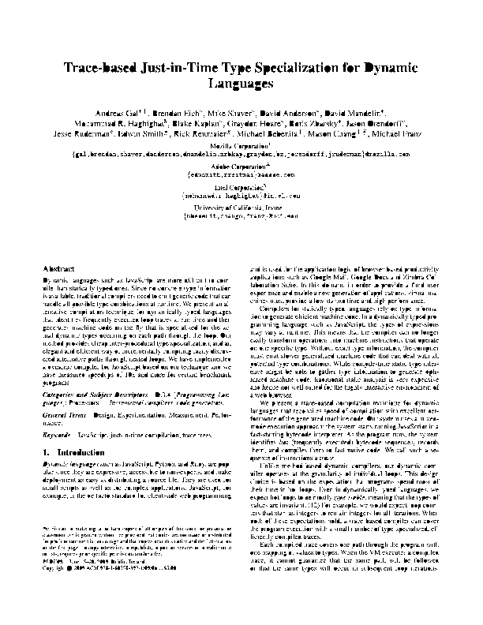
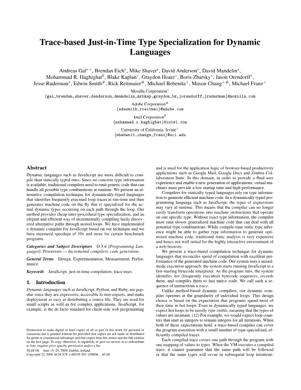

# raylib-canvas

Canvas-like 2D API with swappable `Canvas2DContext` implementations, currently backed by a small JavaScript software rasterizer.

## Goal

`raylib-canvas` is an incremental Canvas 2D implementation for environments where the public API should feel close to web Canvas, while the actual pixels can be produced by different 2D context implementations.

The current package is deliberately small: it grows by adding narrow, tested Canvas API slices, then checking them against unit tests, browser-facing integration tests, selected upstream WPT files, and real consumers such as `pdfjs-dist`.

The long-term direction is:

- keep the public facade close to the web Canvas API;
- make `Canvas2DContext` the drawing implementation contract;
- support the JavaScript context first for correctness and portability;
- add a raylib-oriented context implementation without changing user-facing canvas code.

## Quickstart

From this checkout:

```sh
npm install
npm run build
```

```js
import { createCanvas } from "raylib-canvas";

const canvas = await createCanvas(800, 450);
const ctx = canvas.getContext("2d");

ctx.fillStyle = "#ffffff";
ctx.fillRect(0, 0, 800, 450);

ctx.fillStyle = "#ff0000";
ctx.fillRect(100, 100, 200, 80);

canvas.toBlob((blob) => {
  if (!blob) {
    throw new Error("Could not encode canvas");
  }

  // Use the image/png Blob in Node, a browser, or a test harness.
}, "image/png");
```

Run the browser demo:

```sh
npm run demo:build
npm run demo:serve
```

The demo is served at `http://127.0.0.1:4173/examples/basic.html`.

## Current Canvas Surface

The implemented API is intentionally partial. The current public surface includes:

- `createCanvas(width, height)`;
- `new Canvas(width, height)`;
- `canvas.width`, `canvas.height`, `canvas.getContext("2d")`;
- `canvas.toBlob(callback, "image/png")` and `canvas.toDataURL("image/png")`;
- `CanvasPath2D`, `CanvasImageData`, and `CanvasTransformMatrix` helpers used by tests and the pdf.js harness.

See [docs/API_MATRIX.md](docs/API_MATRIX.md) for the broader Canvas 2D API checklist.

## Backend Contexts

### JavaScript context

The default backend is `JavascriptCanvas2DContext`. It owns an RGBA `Uint8ClampedArray`, rasterizes the currently supported primitives in JavaScript, and is used by the unit, WPT, e2e, and pdf.js tests.

PNG output is handled by `pngjs` behind the injectable `PngEncoder` interface.

### Context factory injection

Custom `Canvas2DContext` implementations can be injected without changing the public canvas facade:

```ts
import { Canvas2DRenderingContext, createCanvas, type Canvas, type Rgba } from "raylib-canvas";

class CustomCanvas2DContext extends Canvas2DRenderingContext {
  readonly #pixels: Uint8ClampedArray;

  constructor(canvas: Canvas) {
    super(canvas);
    this.#pixels = new Uint8ClampedArray(canvas.width * canvas.height * 4);
  }

  protected fillRectPixels(x: number, y: number, width: number, height: number, color: Rgba): void {
    // Forward drawing work to another implementation.
  }

  getPixels(): Uint8ClampedArray {
    // Return RGBA pixels for PNG encoding and getImageData().
    return this.#pixels;
  }
}

const canvas = await createCanvas(800, 450, {
  context: (canvas) => new CustomCanvas2DContext(canvas)
});
```

### raylib context

The raylib backend is available as an opt-in WASM `Canvas2DContext`. The public canvas
facade stays the same: create a raylib context factory, pass it through the
context option, and keep using the 2D context API normally.

```ts
import { createCanvas, createRaylibCanvas2DContextFactory } from "raylib-canvas";

const context = await createRaylibCanvas2DContextFactory();
const canvas = await createCanvas(800, 450, { context });
```

Initialize the pinned raylib checkout, then build the WASM module with
Emscripten before using the default raylib loader. The default path builds
inside a Debian Docker container and writes the WASM artifacts back to
`dist/native`:

```sh
npm run init:raylib
npm run build:raylib-wasm
```

If you already have Emscripten available on your host `PATH`, you can use the
same compiler flags without Docker:

```sh
npm run build:raylib-wasm:native
```

The backend vendors raylib 6.0 under `vendor/raylib`, pinned to tag `6.0`
at commit `dbc56a87da87d973a9c5baa4e7438a9d20121d28`. The C bridge is
compiled with raylib's `PLATFORM_MEMORY` and `GRAPHICS_API_OPENGL_SOFTWARE`
flags and exposes the live RGBA pixel buffer expected by `Canvas2DContext.getPixels()`.

## Tests

```sh
npm run build
npm run test:unit
npm run test:pdfjs
npm run test:wpt
npm run test:e2e
```

Or run the full checked suite:

```sh
npm test
```

Test scripts:

| Command | Purpose |
| --- | --- |
| `npm run init:raylib` | Clones raylib 6.0 into ignored `vendor/raylib` for the optional WASM backend. |
| `npm run test:unit` | Fast Vitest coverage for API behavior and PNG encoding. |
| `npm run test:pdfjs` | Renders a real PDF page through `pdfjs-dist` and this canvas implementation. |
| `npm run test:wpt` | Runs the current green upstream Canvas WPT smoke suite through the browser shim. |
| `npm run test:e2e` | Runs the browser demo with Playwright and samples rendered pixels. |
| `npm run build:raylib-wasm` | Builds the optional raylib WASM backend in a Debian Emscripten Docker container. |
| `npm run build:raylib-wasm:docker` | Same Docker build path as `build:raylib-wasm`. |
| `npm run build:raylib-wasm:native` | Builds the same WASM artifacts with a host Emscripten install on `PATH`. |
| `npm run test:raylib` | Builds and runs the raylib unit, pdf.js, and WPT smoke lanes. |
| `npm run test:unit:raylib` | Runs unit tests through the opt-in raylib context. |
| `npm run test:pdfjs:raylib` | Renders the pdf.js fixture through the opt-in raylib context. |
| `npm run test:wpt:raylib` | Runs the WPT smoke suite with the raylib WASM preload. |
| `npm run wpt:setup` | Fetches the pinned upstream WPT checkout. |
| `npm run wpt:full` | Runs the full upstream `html/canvas` WPT tree. Failures are expected until more Canvas 2D APIs land. |
| `npm run wpt:progress` | Summarizes WPT coverage from reports under `test-results/wpt/`. |

WPT details, including the pinned upstream commit and smoke-suite scope, live in [docs/WPT_COMPATIBILITY.md](docs/WPT_COMPATIBILITY.md).

## Current Test Snapshot

Latest checked WPT smoke report: [test-results/wpt/smoke-report.json](test-results/wpt/smoke-report.json)

- 507 official upstream HTML Canvas files executed.
- 507 files reported expected results.
- 0 unexpected files.
- 0 unexpected subtests/results.
- Covered areas include context creation/sharing, rectangle drawing, paths, colors,
  gradients, patterns, shadows, filters, layers, text state, `drawImage()`,
  compositing, pixel manipulation, reset, and transforms.

The pdf.js integration test renders page 1 of [tests/pdfjs/compressed.tracemonkey-pldi-09.pdf](tests/pdfjs/compressed.tracemonkey-pldi-09.pdf) through `pdfjs-dist`, using this package as the canvas factory. The JavaScript context writes [tests/pdfjs/compressed.tracemonkey-pldi-09-cover.png](tests/pdfjs/compressed.tracemonkey-pldi-09-cover.png), the raylib WASM context writes [tests/pdfjs/compressed.tracemonkey-pldi-09-cover-raylib.png](tests/pdfjs/compressed.tracemonkey-pldi-09-cover-raylib.png), and the native DOM canvas reference writes [tests/pdfjs/compressed.tracemonkey-pldi-09-cover-native.png](tests/pdfjs/compressed.tracemonkey-pldi-09-cover-native.png). Each lane asserts:

- PNG signature is valid.
- Image size is `612x792`.
- Rendered output contains more than 1,000 non-white pixels.

Latest checked pdf.js cover timing report: [test-results/pdfjs/cover-render-performance.json](test-results/pdfjs/cover-render-performance.json)

Latest recorded cover timings from `test-results/pdfjs/cover-render-performance.json`:

| Context | PDF load | Page load | Render | PNG encode | PNG write | Total cover generation |
| --- | ---: | ---: | ---: | ---: | ---: | ---: |
| JavaScript context | 117.63 ms | 1.38 ms | 1654.58 ms | 65.90 ms | 2.12 ms | 1889.43 ms |
| raylib WASM context | 123.24 ms | 1.03 ms | 1562.89 ms | 61.37 ms | 1.94 ms | 1795.80 ms |
| native DOM canvas | 204.80 ms | 4.10 ms | 146.40 ms | 34.40 ms | 1.70 ms | 438.70 ms |

| JavaScript context | raylib WASM context | native DOM canvas |
| --- | --- | --- |
|  |  |  |
